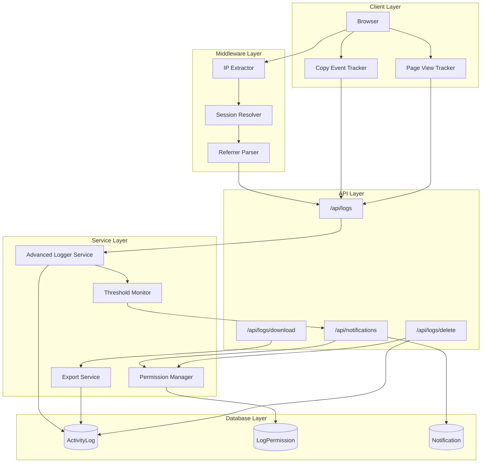

# Design Document: Gelişmiş Loglama Sistemi

## Overview

Bu tasarım, Yetkili Kılavuzu uygulaması için kapsamlı bir loglama sistemi tanımlar. Sistem, mevcut `src/lib/logging.ts` altyapısını genişleterek:

1. **Anonim ziyaretçi takibi** - Giriş yapmamış kullanıcıların IP ve aktivitelerini kaydetme
2. **Detaylı aktivite loglama** - AI sorguları, sayfa erişimleri, aramalar ve metin girişleri
3. **Eşik tabanlı bildirim sistemi** - 50 sayfa (1000 kayıt) birikiminde owner'a bildirim
4. **Log yönetimi** - İndirme ve tek seferlik silme yetkisi döngüsü
5. **Referrer ve kopyalama takibi** - Trafik kaynakları ve içerik kopyalama analizi

Mevcut Next.js 14, Prisma ve PostgreSQL (Neon) altyapısı üzerine inşa edilecektir.

## Architecture



## Components and Interfaces

### 1. Advanced Logger Service

Mevcut `logging.ts` dosyasını genişleten ana loglama servisi.

```typescript
// src/lib/advanced-logging.ts

interface VisitorInfo {
  ipAddress: string;
  userId: string | null;
  sessionId: string | null;
  userAgent: string;
  referrer: string | null;
}

interface AIInteractionLog {
  question: string;
  response: string;
  confidence: 'high' | 'medium' | 'low';
  responseTime: number;
}

interface PageAccessLog {
  url: string;
  title: string;
  category: string;
  contentType: string;
  referrerUrl: string | null;
  accessType: 'direct' | 'navigation' | 'external';
}

interface SearchLog {
  query: string;
  resultsCount: number;
  selectedResult: string | null;
}

interface TextInputLog {
  fieldId: string;
  formContext: string;
  content: string; // Max 1000 chars
  isSensitive: boolean;
}

interface TextCopyLog {
  copiedText: string; // Max 500 chars
  sourcePage: string;
  elementContext: string;
  selectionStart: number;
  selectionEnd: number;
}

interface ReferrerLog {
  referrerUrl: string;
  sourceDomain: string;
  sourceType: 'social' | 'search' | 'direct' | 'other';
}

// Ana servis fonksiyonları
async function logVisitorAccess(visitor: VisitorInfo): Promise<ActivityLog>;
async function logAIInteraction(userId: string, interaction: AIInteractionLog, ip: string): Promise<ActivityLog>;
async function logPageAccess(userId: string, access: PageAccessLog, ip: string): Promise<ActivityLog>;
async function logSearchActivity(userId: string, search: SearchLog, ip: string): Promise<ActivityLog>;
async function logTextInput(userId: string, input: TextInputLog, ip: string): Promise<ActivityLog>;
async function logTextCopy(userId: string, copy: TextCopyLog, ip: string): Promise<ActivityLog>;
async function logReferrer(visitor: VisitorInfo, referrer: ReferrerLog): Promise<ActivityLog>;
```

### 2. Threshold Monitor Service

Log birikimini izleyen ve bildirim tetikleyen servis.

```typescript
// src/lib/log-threshold.ts

interface ThresholdConfig {
  pageSize: number;        // 20 kayıt = 1 sayfa
  notificationThreshold: number; // 50 sayfa = 1000 kayıt
}

interface ThresholdStatus {
  currentCount: number;
  currentPages: number;
  thresholdReached: boolean;
  lastNotificationAt: Date | null;
}

async function checkThreshold(): Promise<ThresholdStatus>;
async function triggerNotification(ownerId: string): Promise<void>;
async function getLogPageCount(): Promise<number>;
```

### 3. Permission Manager Service

İndirme ve silme yetkilerini yöneten servis.

```typescript
// src/lib/log-permission.ts

interface LogPermission {
  id: string;
  userId: string;
  canDownload: boolean;
  canDelete: boolean;
  grantedAt: Date;
  downloadedAt: Date | null;
  deletedAt: Date | null;
}

async function grantDownloadPermission(userId: string): Promise<LogPermission>;
async function grantDeletePermission(userId: string): Promise<LogPermission>;
async function revokeDeletePermission(userId: string): Promise<void>;
async function checkPermission(userId: string, action: 'download' | 'delete'): Promise<boolean>;
async function getPermissionStatus(userId: string): Promise<LogPermission | null>;
```

### 4. Export Service

Log dışa aktarma servisi.

```typescript
// src/lib/log-export.ts

interface ExportOptions {
  format: 'csv' | 'json';
  startDate?: Date;
  endDate?: Date;
  includeAnonymous: boolean;
}

interface ExportResult {
  filename: string;
  content: string;
  recordCount: number;
  exportedAt: Date;
}

async function exportLogs(options: ExportOptions): Promise<ExportResult>;
async function generateFilename(format: 'csv' | 'json'): string;
```

### 5. Client-Side Trackers

Tarayıcı tarafında çalışan izleme bileşenleri.

```typescript
// src/hooks/usePageTracker.ts
function usePageTracker(): void;

// src/hooks/useCopyTracker.ts
function useCopyTracker(): void;

// src/hooks/useReferrerTracker.ts
function useReferrerTracker(): void;
```

### 6. API Endpoints

```typescript
// POST /api/logs/visitor - Ziyaretçi erişimi logla
// POST /api/logs/ai - AI etkileşimi logla
// POST /api/logs/page - Sayfa erişimi logla
// POST /api/logs/search - Arama logla
// POST /api/logs/input - Metin girişi logla
// POST /api/logs/copy - Metin kopyalama logla
// POST /api/logs/referrer - Referrer logla

// GET /api/logs/status - Log durumu ve sayfa sayısı
// GET /api/logs/download - Logları indir
// DELETE /api/logs - Logları sil

// GET /api/logs/permission - Yetki durumu
```

## Data Models

### Mevcut ActivityLog Genişletmesi

Mevcut `ActivityLog` modeli yeterli esnekliğe sahip. `action` ve `details` alanları yeni log türlerini destekleyecek.

### Yeni Action Türleri

```typescript
// Mevcut ActivityAction tipine eklenecekler
type ExtendedActivityAction = ActivityAction
  | 'visitor_access'      // Anonim ziyaretçi erişimi
  | 'ai_interaction'      // AI soru-cevap (detaylı)
  | 'page_access'         // Sayfa erişimi (detaylı)
  | 'text_input'          // Metin girişi
  | 'text_copy'           // Metin kopyalama
  | 'referrer_track'      // Referrer takibi
  | 'url_copy'            // URL kopyalama
  | 'log_download'        // Log indirme
  | 'log_delete';         // Log silme
```

### Yeni LogPermission Modeli

```prisma
// prisma/schema.prisma'ya eklenecek

model LogPermission {
  id           String    @id @default(cuid())
  userId       String    @unique
  canDownload  Boolean   @default(false)
  canDelete    Boolean   @default(false)
  grantedAt    DateTime  @default(now())
  downloadedAt DateTime?
  deletedAt    DateTime?
  
  user User @relation(fields: [userId], references: [id], onDelete: Cascade)
  
  @@map("log_permissions")
}
```

### Yeni LogThreshold Modeli

```prisma
// Log eşik durumunu takip etmek için

model LogThreshold {
  id                   String    @id @default(cuid())
  lastNotificationAt   DateTime?
  lastNotificationCount Int      @default(0)
  lastDownloadAt       DateTime?
  lastDeleteAt         DateTime?
  
  @@map("log_thresholds")
}
```

### Details JSON Yapıları

```typescript
// visitor_access details
interface VisitorAccessDetails {
  event: 'visitor_access';
  userAgent: string;
  referrer: string | null;
  isAnonymous: boolean;
  timestamp: string;
}

// ai_interaction details
interface AIInteractionDetails {
  event: 'ai_interaction';
  question: string;      // Max 2000 chars
  response: string;      // Max 2000 chars
  confidence: string;
  responseTime: number;
  timestamp: string;
}

// page_access details
interface PageAccessDetails {
  event: 'page_access';
  url: string;
  title: string;
  category: string;
  contentType: string;
  referrerUrl: string | null;
  accessType: string;
  timestamp: string;
}

// text_copy details
interface TextCopyDetails {
  event: 'text_copy';
  copiedText: string;    // Max 500 chars
  sourcePage: string;
  elementContext: string;
  selectionStart: number;
  selectionEnd: number;
  timestamp: string;
}

// referrer_track details
interface ReferrerTrackDetails {
  event: 'referrer_track';
  referrerUrl: string;
  sourceDomain: string;
  sourceType: string;
  timestamp: string;
}
```


## Correctness Properties

*A property is a characteristic or behavior that should hold true across all valid executions of a system—essentially, a formal statement about what the system should do. Properties serve as the bridge between human-readable specifications and machine-verifiable correctness guarantees.*

### Property 1: IP ve Kullanıcı Bilgisi Loglama

*For any* visitor (anonymous or authenticated) accessing any page, the created log entry SHALL contain a valid IP address and appropriate user identifier (user ID for authenticated, "anonymous" for unauthenticated).

**Validates: Requirements 1.1, 1.2, 1.3, 1.4**

### Property 2: AI Etkileşim Loglama

*For any* AI interaction, the log entry SHALL contain both the question and response texts linked together, along with timestamp, user identifier, and session context in a single record.

**Validates: Requirements 2.1, 2.2, 2.3, 2.5**

### Property 3: Metin Truncation

*For any* text input exceeding the defined limit (2000 chars for AI, 1000 chars for input, 500 chars for copy), the logged text SHALL be truncated to exactly the maximum allowed length.

**Validates: Requirements 2.4, 5.4, 10.3**

### Property 4: Sayfa Erişim Loglama

*For any* page navigation, the log entry SHALL contain the page URL, title, category, content type, referrer URL (if available), and correct access type classification (direct/navigation/external).

**Validates: Requirements 3.1, 3.2, 3.3, 3.4**

### Property 5: Arama Loglama

*For any* search operation (successful or zero-result), the log entry SHALL contain the search query, results count, and selected result (if any).

**Validates: Requirements 4.1, 4.2, 4.3, 4.4**

### Property 6: Hassas Alan Filtreleme

*For any* text input from a sensitive field (password, personal data), the Logging_System SHALL NOT create a log entry for that input.

**Validates: Requirements 5.1, 5.2, 5.3**

### Property 7: Eşik Bildirimi

*For any* log count reaching 50 pages (1000 entries), exactly one notification SHALL be sent to the Owner, and Download_Permission SHALL be granted. No duplicate notifications SHALL be sent until logs are downloaded and deleted.

**Validates: Requirements 6.1, 6.3, 6.4, 6.5**

### Property 8: Log Export Round-Trip

*For any* log export operation, the exported file SHALL be valid CSV or JSON format, contain all log entries since last download, and have a unique filename with timestamp.

**Validates: Requirements 7.2, 7.3, 7.5**

### Property 9: Yetki State Machine

*For any* permission state transition:
- Download completes → Delete_Permission granted
- Delete completes → Delete_Permission revoked
- Delete_Permission revoked → requires 50 more pages for new permission
- Deletion without permission → request rejected
- Deletion action → logged before removal

**Validates: Requirements 7.4, 8.2, 8.3, 8.4, 8.5, 8.6**

### Property 10: Referrer Loglama

*For any* external referrer, the log entry SHALL contain the referrer URL, extracted source domain, correct source type classification (social/search/direct/other), and increment the source counter.

**Validates: Requirements 9.1, 9.3, 9.4, 9.5**

### Property 11: URL Kopyalama Loglama

*For any* site URL copy event, the log entry SHALL contain the copy event with page context.

**Validates: Requirements 9.2**

### Property 12: Metin Kopyalama Loglama

*For any* text copy event, the log entry SHALL contain the copied text, source page, element context, and selection start/end positions.

**Validates: Requirements 10.1, 10.2, 10.4**

### Property 13: Log Persistence

*For any* valid log entry, it SHALL be persisted to the database immediately, maintain chronological order by timestamp, pass format validation, and be unique (no duplicates for same event).

**Validates: Requirements 11.1, 11.3, 11.4, 11.5**

### Property 14: Retry Mekanizması

*For any* failed logging operation, the system SHALL retry up to 3 times before discarding the log entry.

**Validates: Requirements 11.2**

## Error Handling

### Loglama Hataları

| Hata Durumu | Davranış |
|-------------|----------|
| Veritabanı bağlantı hatası | 3 kez retry, sonra discard ve console.error |
| Geçersiz IP formatı | Varsayılan "0.0.0.0" kullan |
| Eksik zorunlu alan | Log kaydını reddet, hata fırlat |
| Metin limiti aşımı | Otomatik truncate |
| Duplicate event | Sessizce yoksay |

### Bildirim Hataları

| Hata Durumu | Davranış |
|-------------|----------|
| Owner bulunamadı | Sistem loguna kaydet, bildirimi atla |
| Bildirim oluşturma hatası | Retry, başarısız olursa sonraki eşikte tekrar dene |

### Yetki Hataları

| Hata Durumu | Davranış |
|-------------|----------|
| Yetkisiz indirme denemesi | 403 Forbidden döndür |
| Yetkisiz silme denemesi | 403 Forbidden döndür |
| Yetki kaydı bulunamadı | Yeni kayıt oluştur (varsayılan: tüm yetkiler false) |

### Export Hataları

| Hata Durumu | Davranış |
|-------------|----------|
| Boş log listesi | Boş dosya döndür (header only for CSV) |
| Büyük veri seti | Streaming response kullan |
| Format hatası | 400 Bad Request döndür |

## Testing Strategy

### Dual Testing Approach

Bu özellik için hem unit testler hem de property-based testler kullanılacaktır:

- **Unit Tests**: Spesifik örnekler, edge case'ler ve hata durumları
- **Property Tests**: Evrensel özellikler, tüm girdiler için geçerli kurallar

### Property-Based Testing Configuration

- **Library**: `fast-check` (TypeScript için)
- **Minimum Iterations**: 100 per property
- **Tag Format**: `Feature: gelismis-loglama, Property {number}: {property_text}`

### Test Dosya Yapısı

```
__tests__/
├── unit/
│   └── advanced-logging.test.ts
│   └── log-threshold.test.ts
│   └── log-permission.test.ts
│   └── log-export.test.ts
└── property/
    └── advanced-logging.property.test.ts
```

### Unit Test Kapsamı

1. **Loglama Fonksiyonları**
   - Her log türü için başarılı kayıt
   - Eksik alan validasyonu
   - Truncation davranışı
   - Hassas alan filtreleme

2. **Eşik Monitörü**
   - Eşik hesaplama
   - Bildirim tetikleme
   - Duplicate bildirim engelleme

3. **Yetki Yönetimi**
   - Yetki verme/alma
   - State geçişleri
   - Yetkisiz erişim reddi

4. **Export Servisi**
   - CSV format doğruluğu
   - JSON format doğruluğu
   - Dosya adı benzersizliği

### Property Test Kapsamı

Her property için ayrı test:

1. **Property 1**: Rastgele visitor bilgileri → IP ve user ID doğrulaması
2. **Property 2**: Rastgele AI etkileşimleri → Tüm alanların varlığı
3. **Property 3**: Rastgele uzun metinler → Truncation doğrulaması
4. **Property 4**: Rastgele sayfa erişimleri → Metadata doğrulaması
5. **Property 5**: Rastgele aramalar → Query ve sonuç loglama
6. **Property 6**: Hassas/normal alanlar → Filtreleme doğrulaması
7. **Property 7**: Log sayısı simülasyonu → Bildirim davranışı
8. **Property 8**: Rastgele loglar → Export round-trip
9. **Property 9**: State geçişleri → Yetki state machine
10. **Property 10**: Rastgele referrer'lar → Kategorileme doğrulaması
11. **Property 11**: URL kopyalama olayları → Context loglama
12. **Property 12**: Metin kopyalama olayları → Pozisyon loglama
13. **Property 13**: Rastgele log kayıtları → Persistence doğrulaması
14. **Property 14**: Simüle edilmiş hatalar → Retry davranışı
