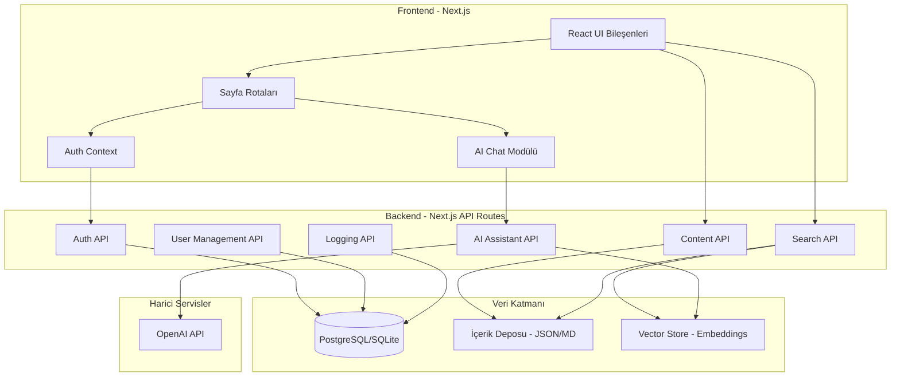

# Tasarım Belgesi

## Genel Bakış

Bu belge, "SANIYE MODLARI" Discord sunucusu için Yetkili Kılavuzu ve Ceza Danışman Sistemi'nin teknik tasarımını tanımlar. Sistem, Next.js tabanlı full-stack bir web uygulaması olarak geliştirilecek, rol tabanlı erişim kontrolü (RBAC), RAG tabanlı AI asistan ve modüler içerik yönetimi içerecektir.

## Mimari

### Sistem Mimarisi



### Katmanlı Mimari

```
┌─────────────────────────────────────────────────────────────┐
│                    Sunum Katmanı (Frontend)                  │
│  ┌─────────┐ ┌─────────┐ ┌─────────┐ ┌─────────────────┐   │
│  │ Layout  │ │ Sidebar │ │ Content │ │ AI Chat Bubble  │   │
│  └─────────┘ └─────────┘ └─────────┘ └─────────────────┘   │
├─────────────────────────────────────────────────────────────┤
│                    İş Mantığı Katmanı (API)                  │
│  ┌─────────┐ ┌─────────┐ ┌─────────┐ ┌─────────────────┐   │
│  │  Auth   │ │  User   │ │ Content │ │   AI Service    │   │
│  │ Service │ │ Service │ │ Service │ │   (RAG)         │   │
│  └─────────┘ └─────────┘ └─────────┘ └─────────────────┘   │
├─────────────────────────────────────────────────────────────┤
│                    Veri Erişim Katmanı                       │
│  ┌─────────────────┐ ┌─────────────────┐ ┌───────────────┐ │
│  │   Database ORM  │ │  Content Loader │ │ Vector Store  │ │
│  └─────────────────┘ └─────────────────┘ └───────────────┘ │
└─────────────────────────────────────────────────────────────┘
```

## Bileşenler ve Arayüzler

### Frontend Bileşenleri

#### 1. Layout Bileşeni
```typescript
interface LayoutProps {
  children: React.ReactNode;
  sidebar?: boolean;
}

// Ana layout - koyu tema, Discord uyumlu
// Sol sidebar + ana içerik alanı + sağ alt chat bubble
```

#### 2. Sidebar Bileşeni
```typescript
interface SidebarItem {
  id: string;
  label: string;
  icon: string;
  href: string;
  children?: SidebarItem[];
}

interface SidebarProps {
  items: SidebarItem[];
  activeItem: string;
  onItemClick: (id: string) => void;
}

// Menü öğeleri:
// - Yetkili Kılavuzu (alt bölümlerle)
// - Cezalar (kategorilere ayrılmış)
// - Komutlar
// - Prosedürler
// - Admin Paneli (sadece admin/mod için)
```

#### 3. SearchBar Bileşeni
```typescript
interface SearchResult {
  id: string;
  type: 'madde' | 'ceza' | 'komut' | 'ihlal';
  title: string;
  excerpt: string;
  category: string;
  relevanceScore: number;
}

interface SearchBarProps {
  onSearch: (query: string) => Promise<SearchResult[]>;
  placeholder?: string;
}
```

#### 4. AI Chat Bubble Bileşeni
```typescript
interface ChatMessage {
  id: string;
  role: 'user' | 'assistant';
  content: string;
  timestamp: Date;
  penaltyRecord?: PenaltyRecord;
}

interface PenaltyRecord {
  violation: string;
  duration: string;
  article: string;
  reason: string;
  copyableText: string;
}

interface AIChatProps {
  isOpen: boolean;
  onToggle: () => void;
  messages: ChatMessage[];
  onSendMessage: (message: string) => Promise<void>;
}
```

#### 5. ContentViewer Bileşeni
```typescript
interface ContentSection {
  id: string;
  title: string;
  content: string; // Markdown formatında
  subsections?: ContentSection[];
}

interface ContentViewerProps {
  section: ContentSection;
  highlightTerms?: string[];
}
```

#### 6. AdminPanel Bileşeni
```typescript
interface PendingUser {
  id: string;
  username: string;
  email: string;
  registeredAt: Date;
  status: 'pending' | 'approved' | 'rejected';
}

interface AdminPanelProps {
  pendingUsers: PendingUser[];
  onApprove: (userId: string, role: UserRole) => Promise<void>;
  onReject: (userId: string) => Promise<void>;
  logs: ActivityLog[];
}
```

#### 7. ContentEditor Bileşeni (Sadece Üst Yetkili)
```typescript
interface ContentEditorProps {
  /** İçerik tipi */
  type: 'guide' | 'penalty' | 'command' | 'procedure';
  /** Mevcut içerik (düzenleme için) veya null (yeni ekleme için) */
  content?: GuideContent | PenaltyDefinition | CommandDefinition | ProcedureDefinition | null;
  /** Kaydetme callback */
  onSave: (content: any) => Promise<void>;
  /** İptal callback */
  onCancel: () => void;
}

// Sadece ust_yetkili rolü bu bileşeni görebilir
// Markdown editör ile içerik düzenleme
// Önizleme modu
// Kaydet/İptal butonları
```

#### 8. Breadcrumb Bileşeni
```typescript
interface BreadcrumbItem {
  label: string;
  href: string;
}

interface BreadcrumbProps {
  items: BreadcrumbItem[];
}

// Örnek: Ana Sayfa > Cezalar > Yazılı Cezalar > ADK Cezası
// Her öğe tıklanabilir link
// Son öğe aktif (tıklanamaz)
```

#### 9. BackButton Bileşeni
```typescript
interface BackButtonProps {
  /** Varsayılan geri URL (history yoksa) */
  fallbackUrl?: string;
  /** Buton metni */
  label?: string;
}

// Tarayıcı history'si varsa geri git
// Yoksa fallbackUrl'e yönlendir
// Her içerik sayfasında görünür
```

### Backend API Endpoints

#### Auth API
```typescript
// POST /api/auth/register
interface RegisterRequest {
  username: string;
  email: string;
  password: string;
}

interface RegisterResponse {
  success: boolean;
  message: string;
  userId?: string;
}

// POST /api/auth/login
interface LoginRequest {
  email: string;
  password: string;
}

interface LoginResponse {
  success: boolean;
  token?: string;
  user?: UserInfo;
  error?: string;
}

// POST /api/auth/logout
// GET /api/auth/me
```

#### User Management API
```typescript
// GET /api/admin/users/pending
// POST /api/admin/users/:id/approve
interface ApproveRequest {
  role: 'mod' | 'admin' | 'ust_yetkili';
}

// POST /api/admin/users/:id/reject
// PUT /api/admin/users/:id/role
```

#### Content API
```typescript
// GET /api/content/sections
// GET /api/content/sections/:id
// GET /api/content/penalties
// GET /api/content/commands
// GET /api/content/procedures
```

#### Search API
```typescript
// GET /api/search?q={query}
interface SearchResponse {
  results: SearchResult[];
  totalCount: number;
  query: string;
}
```

#### AI Assistant API
```typescript
// POST /api/ai/chat
interface ChatRequest {
  message: string;
  conversationId?: string;
}

interface ChatResponse {
  response: string;
  penaltyRecord?: PenaltyRecord;
  sources: string[]; // Referans alınan içerik bölümleri
  confidence: 'high' | 'medium' | 'low';
}
```

#### Content Management API (Sadece Üst Yetkili)
```typescript
// PUT /api/content/sections/:id - İçerik güncelleme
interface UpdateContentRequest {
  title?: string;
  content?: string;
  keywords?: string[];
}

interface UpdateContentResponse {
  success: boolean;
  updatedAt: Date;
}

// POST /api/content/sections - Yeni içerik ekleme
interface CreateContentRequest {
  type: 'guide' | 'penalty' | 'command' | 'procedure';
  data: GuideContent | PenaltyDefinition | CommandDefinition | ProcedureDefinition;
}

// DELETE /api/content/sections/:id - İçerik silme
// Sadece ust_yetkili rolü erişebilir
```

## Veri Modelleri

### Veritabanı Şeması

```typescript
// User Model
interface User {
  id: string;
  username: string;
  email: string;
  passwordHash: string;
  status: 'pending' | 'approved' | 'rejected';
  role: 'none' | 'mod' | 'admin' | 'ust_yetkili';
  createdAt: Date;
  updatedAt: Date;
  lastLoginAt?: Date;
}

// Activity Log Model
interface ActivityLog {
  id: string;
  userId: string;
  action: 'login' | 'logout' | 'view_content' | 'search' | 'ai_query' | 'role_change' | 'user_approve' | 'user_reject';
  details: Record<string, any>;
  ipAddress: string;
  timestamp: Date;
}

// Session Model
interface Session {
  id: string;
  userId: string;
  token: string;
  expiresAt: Date;
  createdAt: Date;
}
```

### İçerik Veri Yapısı

```typescript
// Yetkili Kılavuzu İçerik Yapısı
interface GuideContent {
  id: string;
  title: string;
  slug: string;
  category: 'kilavuz' | 'ceza' | 'komut' | 'prosedur';
  subcategory?: string; // cezalar için: 'yazili', 'sesli', 'ekstra', 'marked', 'blacklist'
  content: string; // Markdown
  keywords: string[]; // Arama için
  relatedArticles: string[];
  order: number;
}

// Ceza Tanımı
interface PenaltyDefinition {
  id: string;
  code: string; // örn: "ADK-001"
  name: string;
  category: 'yazili' | 'sesli' | 'ekstra' | 'marked' | 'blacklist';
  duration: string;
  description: string;
  conditions: string[];
  alternatives?: string[];
  examples: string[];
}

// Komut Tanımı
interface CommandDefinition {
  id: string;
  command: string;
  description: string;
  usage: string;
  permissions: string[];
  examples: string[];
}
```

### RAG Veri Yapısı

```typescript
// Vector Embedding için chunk yapısı
interface ContentChunk {
  id: string;
  sourceId: string; // GuideContent.id
  content: string;
  embedding: number[]; // OpenAI embedding vektörü
  metadata: {
    title: string;
    category: string;
    keywords: string[];
  };
}
```

## Doğruluk Özellikleri

*Bir özellik (property), sistemin tüm geçerli çalışmalarında doğru olması gereken bir karakteristik veya davranıştır. Özellikler, insan tarafından okunabilir spesifikasyonlar ile makine tarafından doğrulanabilir doğruluk garantileri arasında köprü görevi görür.*


### Property 1: Kayıt Durumu Tutarlılığı

*Herhangi bir* geçerli kayıt isteği için, kayıt işlemi tamamlandığında kullanıcı veritabanında "Beklemede" durumunda bulunmalıdır.

**Validates: Requirements 1.1**

### Property 2: Kimlik Doğrulama Round-Trip

*Herhangi bir* kayıtlı kullanıcı için, doğru kimlik bilgileriyle giriş yapıldığında oturum oluşturulmalı ve çıkış yapıldığında oturum geçersiz hale gelmelidir. Geçersiz kimlik bilgileriyle giriş denemesi her zaman reddedilmelidir.

**Validates: Requirements 1.2, 1.3, 1.4**

### Property 3: Yetki Tabanlı Erişim Kontrolü

*Herhangi bir* sayfa isteği için, kullanıcının yetki durumu kontrol edilmeli ve:
- Onaylanmamış/yetkisiz kullanıcılar sadece engelleme mesajını görmeli
- Onaylı kullanıcılar yetki seviyelerine uygun içeriğe erişebilmeli
- "Beklemede" durumundaki kullanıcılar ana içeriğe erişememeli

**Validates: Requirements 2.1, 2.2, 2.3, 2.4**

### Property 4: Admin Kullanıcı Yönetimi Tutarlılığı

*Herhangi bir* admin işlemi için:
- Bekleyen kullanıcılar listesi tüm "Beklemede" durumundaki kullanıcıları içermeli
- Onaylama işlemi kullanıcı durumunu "Onaylı" yapmalı ve yetki atamalı
- Reddetme işlemi kullanıcı durumunu "Reddedildi" yapmalı
- Yetki değişiklikleri hem veritabanına hem log'a kaydedilmeli

**Validates: Requirements 3.1, 3.2, 3.3, 3.4**

### Property 5: İçerik Erişimi Tutarlılığı

*Herhangi bir* bölüm seçimi için, seçilen bölümün içeriği ana alanda doğru şekilde gösterilmelidir.

**Validates: Requirements 4.2**

### Property 6: Arama Sonuçları Tutarlılığı

*Herhangi bir* arama sorgusu için, dönen sonuçlar:
- İlgili kategorilerde (madde, ceza, komut, ihlal) olmalı
- Kategori ve ilgililik sırasına göre sıralanmalı
- Sorgu terimiyle ilişkili olmalı

**Validates: Requirements 5.1, 5.2**

### Property 7: AI Yanıt Kaynak Tutarlılığı

*Herhangi bir* AI ceza sorusu için, verilen yanıt "Yetkili Kılavuzu v2" içeriğiyle tutarlı olmalı ve kaynak referansları içermelidir.

**Validates: Requirements 6.1, 6.4**

### Property 8: AI Ceza Analizi Tamlığı

*Herhangi bir* olay anlatımı için, AI yanıtı:
- İhlal analizini içermeli
- Uygun cezayı belirtmeli
- Ceza maddesini, süresini, gerekçesini içermeli
- Kopyalanabilir ceza kaydı metni oluşturmalı

**Validates: Requirements 6.2, 6.3**

### Property 9: AI Belirsizlik Yönetimi

*Herhangi bir* düşük güven skorlu AI yanıtı için, "Bu durumda üst yetkililere danışılmalıdır." mesajı verilmelidir.

**Validates: Requirements 6.5**

### Property 10: Ceza Kaydı Format Tamlığı

*Herhangi bir* ceza kaydı için, kayıt metni ihlal türü, ceza süresi, madde numarası ve gerekçeyi içermelidir.

**Validates: Requirements 7.1, 7.2**

### Property 11: Kapsamlı Loglama

*Herhangi bir* sistem aktivitesi için (giriş, içerik erişimi, yetki değişikliği, yetkisiz erişim denemesi), ilgili log kaydı oluşturulmalıdır.

**Validates: Requirements 3.5, 9.1, 9.2, 9.4**

### Property 12: İçerik Düzenleme Yetki Kontrolü

*Herhangi bir* içerik düzenleme isteği için:
- Sadece "ust_yetkili" rolüne sahip kullanıcılar düzenleme yapabilmeli
- Mod ve admin rolleri düzenleme butonunu görmemeli
- Tüm düzenleme işlemleri loglanmalı

**Validates: Requirements 11.1, 11.5, 11.6**

### Property 13: Navigasyon Tutarlılığı

*Herhangi bir* içerik sayfası için:
- Geri butonu her zaman görünür olmalı
- Ana sayfaya dönüş linki header'da bulunmalı
- Breadcrumb navigasyonu mevcut konumu doğru göstermeli

**Validates: Requirements 12.1, 12.3, 12.4**

## Hata Yönetimi

### Kimlik Doğrulama Hataları

| Hata Durumu | Hata Kodu | Kullanıcı Mesajı | Sistem Davranışı |
|-------------|-----------|------------------|------------------|
| Geçersiz email formatı | AUTH_001 | "Geçerli bir email adresi giriniz" | Form gönderimini engelle |
| Şifre çok kısa | AUTH_002 | "Şifre en az 8 karakter olmalıdır" | Form gönderimini engelle |
| Email zaten kayıtlı | AUTH_003 | "Bu email adresi zaten kullanılıyor" | Kayıt işlemini reddet |
| Geçersiz kimlik bilgileri | AUTH_004 | "Email veya şifre hatalı" | Giriş işlemini reddet, log kaydet |
| Oturum süresi dolmuş | AUTH_005 | "Oturumunuz sona erdi, lütfen tekrar giriş yapın" | Giriş sayfasına yönlendir |

### Yetkilendirme Hataları

| Hata Durumu | Hata Kodu | Kullanıcı Mesajı | Sistem Davranışı |
|-------------|-----------|------------------|------------------|
| Yetkisiz erişim | AUTHZ_001 | "BU SİTE SADECE SANİYE MODLARINA AİTTİR" | Sadece bu mesajı göster |
| Beklemede durumu | AUTHZ_002 | "Hesabınız henüz onaylanmadı" | Bekleme sayfası göster |
| Yetersiz yetki seviyesi | AUTHZ_003 | "Bu işlem için yetkiniz bulunmamaktadır" | İşlemi reddet |

### API Hataları

| Hata Durumu | Hata Kodu | HTTP Status | Sistem Davranışı |
|-------------|-----------|-------------|------------------|
| Geçersiz istek | API_001 | 400 | Hata detaylarını döndür |
| Kimlik doğrulama gerekli | API_002 | 401 | Giriş sayfasına yönlendir |
| Erişim reddedildi | API_003 | 403 | Yetki hatası mesajı |
| Kaynak bulunamadı | API_004 | 404 | "İçerik bulunamadı" mesajı |
| Sunucu hatası | API_005 | 500 | Genel hata mesajı, detayları logla |

### AI Asistan Hataları

| Hata Durumu | Hata Kodu | Kullanıcı Mesajı | Sistem Davranışı |
|-------------|-----------|------------------|------------------|
| AI servisi erişilemez | AI_001 | "Asistan şu anda kullanılamıyor, lütfen daha sonra tekrar deneyin" | Fallback mesajı göster |
| İçerik bulunamadı | AI_002 | "Bu konuda bilgi bulunamadı. Üst yetkililere danışılmalıdır." | Belirsizlik yanıtı ver |
| Rate limit aşıldı | AI_003 | "Çok fazla istek gönderildi, lütfen bekleyin" | İstek kuyruğuna al |

## Test Stratejisi

### Genel Yaklaşım

Bu proje için iki tür test kullanılacaktır:

1. **Unit Testler**: Belirli örnekler, edge case'ler ve hata durumları için
2. **Property-Based Testler**: Evrensel özellikler için rastgele girişlerle

Her iki test türü birbirini tamamlar ve kapsamlı kapsama sağlar.

### Property-Based Testing Konfigürasyonu

- **Kütüphane**: fast-check (TypeScript/JavaScript için)
- **Minimum iterasyon**: Her property testi için 100 iterasyon
- **Tag formatı**: `Feature: yetkili-kilavuzu, Property {number}: {property_text}`

### Test Kategorileri

#### 1. Kimlik Doğrulama Testleri

**Unit Testler:**
- Geçerli kayıt akışı
- Geçersiz email formatı reddi
- Şifre validasyonu
- Giriş/çıkış akışı

**Property Testler:**
- Property 1: Kayıt durumu tutarlılığı
- Property 2: Kimlik doğrulama round-trip

#### 2. Yetkilendirme Testleri

**Unit Testler:**
- Yetkisiz kullanıcı engelleme
- Beklemede kullanıcı engelleme
- Admin panel erişimi

**Property Testler:**
- Property 3: Yetki tabanlı erişim kontrolü

#### 3. Admin Panel Testleri

**Unit Testler:**
- Kullanıcı onaylama akışı
- Kullanıcı reddetme akışı
- Yetki seviyesi değiştirme

**Property Testler:**
- Property 4: Admin kullanıcı yönetimi tutarlılığı

#### 4. İçerik ve Arama Testleri

**Unit Testler:**
- Bölüm navigasyonu
- Yaygın terim aramaları ("hakaret", "adk", vb.)
- Boş arama sonucu

**Property Testler:**
- Property 5: İçerik erişimi tutarlılığı
- Property 6: Arama sonuçları tutarlılığı

#### 5. AI Asistan Testleri

**Unit Testler:**
- Basit ceza sorusu yanıtı
- Olay analizi yanıtı
- Belirsiz durum yanıtı

**Property Testler:**
- Property 7: AI yanıt kaynak tutarlılığı
- Property 8: AI ceza analizi tamlığı
- Property 9: AI belirsizlik yönetimi
- Property 10: Ceza kaydı format tamlığı

#### 6. Loglama Testleri

**Unit Testler:**
- Giriş log kaydı
- İçerik erişim log kaydı
- Yetkisiz erişim log kaydı

**Property Testler:**
- Property 11: Kapsamlı loglama

### Test Dosya Yapısı

```
__tests__/
├── unit/
│   ├── auth.test.ts
│   ├── authorization.test.ts
│   ├── admin.test.ts
│   ├── content.test.ts
│   ├── search.test.ts
│   ├── ai-assistant.test.ts
│   └── logging.test.ts
├── property/
│   ├── auth.property.test.ts
│   ├── authorization.property.test.ts
│   ├── admin.property.test.ts
│   ├── content.property.test.ts
│   ├── search.property.test.ts
│   ├── ai-assistant.property.test.ts
│   └── logging.property.test.ts
└── integration/
    ├── auth-flow.test.ts
    ├── admin-flow.test.ts
    └── ai-chat-flow.test.ts
```

### Test Çalıştırma

```bash
# Tüm testleri çalıştır
npm test

# Sadece unit testleri
npm run test:unit

# Sadece property testleri
npm run test:property

# Sadece integration testleri
npm run test:integration
```
